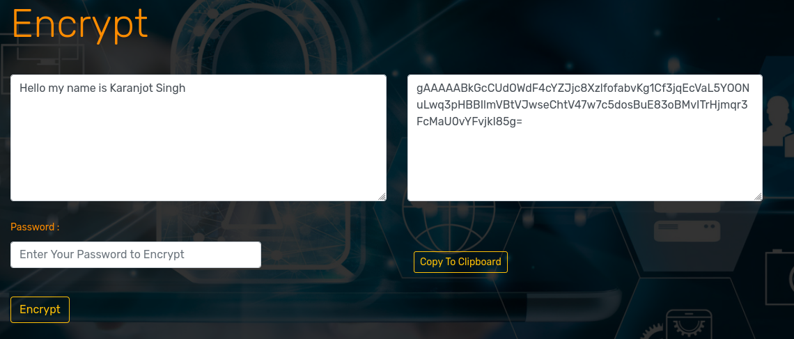

# Crypt4GH GSoC

### Index
1. [Introduction](#introduction)
1. [Pre-Requirements](#pre-requirements)
2. [Installation](#installation)
3. [How it work](#how-it-work)
    1.[Encryption Page](#encryption-page)
    2.[Decryption Page](#decryption-page)
    3.[Words Encryption](#words-encryption)
    4.[Words Decrypted](#words-decrypted)

### Introduction
It is the demo project of my GSoC project name Cryptography: Data API serving Crypt4GH-encrypted files with a custom Crypt4GH.header and the irganisation name is Global Alliance for Genomics and Health.

### Pre-Requirements
Python 3.10+
Django 4+

### Installation
```bash
git clone https://github.com/Karanjot786/Crypt4GH_gsoc
cd Crypt4GH_gsoc
sudo pip3 install virtualenv
virtualenv env
source env/bin/activate
pip install -r requirements.txt
```

### Development
To setuo the development environment
```bash
python3 manage.py makemigrations
python3 manage.py migrate
```

To run the development server
```bash
python3 manage.py runserver
```
Open “http://127.0.0.1:8000” in your browser.


### How it work


To secure personal data, Crypt4GH is designed to encrypt critical files with a password before downloading the file. If they ever need to access the encrypted file, they may decrypt the downloaded file since there is a blog where users can read the most recent security concerns. 

<!-- 1. Home Page of website
 -->

#### Encryption Page
Choose the File to Encrypt option, provide the desired password (which will be the file's private key, which will be needed to decrypt your file), and then click the Encrypt button. 

Then it will be download the encrypted file 

Here is model of encrypted 
```python
class EncryptedPath(models.Model):
    user = models.ForeignKey(User,on_delete=models.CASCADE)
    edate = models.DateTimeField(default=now)
    efilename = models.CharField(max_length=30)
    fpath = models.FilePathField(path='media/encrypted_file/')
    password = models.CharField(max_length=20)

    def __str__(self):
        return self.fpath
```

Here is view of encrypted
```python
def encrypt(request):
    user = request.user
    try:
        if request.method == "POST" and user.is_authenticated:
            filename = request.POST.get('ename')
            efile = request.FILES.get('files')
            password = request.POST.get('efile_password')

            if not filename:
                messages.error(request," Filename is Required")
            elif len(filename) < 5 :
                messages.error(request," Filename must be 5 char long...")
            elif len(filename) > 30:
                messages.error(request," Filename must be less than 30 char...")
            elif not efile:
                messages.error(request," File is Required")
            elif efile.size > 104857600:
                messages.error(request," File should not more than 99 MB ")
            elif not password:
                messages.error(request," Password is Required")
            elif len(password) < 6:
                messages.error(request,' Password must be 6 char long..')
            elif len(password) > 20:
                messages.error(request," Password must be less than 20 char....")
            else:
                modified_name = change_name(efile.name)

                file_root,file_ext = os.path.splitext(modified_name)
                fal = Storage.get_alternative_name(request,file_root,file_ext)
            
            
                pat = f'media/encrypt/{modified_name}'


                data = efile.read()
                fl,ext = os.path.splitext(fal)
                fkey = f(p(password))
                enc = fkey.encrypt(data)
                file = f"./media/encrypted_file/{fl[0:]+ext}.en"
                encryptedpath = EncryptedPath(user=user,fpath=file,efilename=filename,password=password)
                encryptedpath.save()
                with open(file,'wb') as encfile:
                    encfile.write(enc)
                    print(file)
                
                subject, from_email, to = 'Crypt4GH Encryption', obj['from_mail'], user.email
                now = datetime.now()
                day = date.today()
                d1 = day.strftime("%B %d , %Y")
                html_content = render_to_string('crypto_app/registersend.html', {'name':user.first_name , 'file':filename,'user':user,'time':now,'date':d1,'s':"encrypted"}) # render with dynamic value
                text_content = strip_tags(html_content) # Strip the html tag. So people can see the pure text at least.

                # create the email, and attach the HTML version as well.
                msg = EmailMultiAlternatives(subject, text_content, from_email, [to])
                msg.attach_alternative(html_content, "text/html")
                msg.send()


                messages.success(request," Sucessfully File Encrypted ")
                return redirect('encrypted')
    except:
        messages.error(request," !! Please try a file without special charcters !!")

   
    return render(request, 'crypto_app/encrypt.html')
```


#### Decryption Page
Input the file's name, then choose the file to be decrypted, add the password to the file's encryption, then press the decrypt button. 

Then it will be download the decrypted file

Here is model of decrypted
```python
class DecryptedPath(models.Model):
    user = models.ForeignKey(User,on_delete=models.CASCADE)
    dfilename = models.CharField(max_length=30)
    ddate = models.DateTimeField(default=now)
    fpath = models.FilePathField(path='media/decrypted/')
    password = models.CharField(max_length=20)

    def __str__(self):
        return self.fpath
```

Here is view of decrypted
```python
def decrypt(request):
    user = request.user
    try:
        if request.method == "POST" and user.is_authenticated:
            filename = request.POST.get('name')
            dfile = request.FILES.get('files')
            password = request.POST.get('password')

        
            if not filename:
                messages.error(request," Filename is Required")
            elif len(filename) < 5 :
                messages.error(request," Filename must be 5 char long...")
            elif len(filename) > 30:
                messages.error(request," Filename must be less than 30 char...")
            elif not dfile:
                messages.error(request," File is Required")
            elif dfile.size > 52428800:
                messages.error(request," File should not more than 400MB ")
            elif not password:
                messages.error(request," Password is Required")
            elif len(password) < 6:
                messages.error(request,' Password must be 6 char long..')
            elif len(password) > 20:
                messages.error(request," Password must be less than 20 char....")
            else:
                
                modified_name = change_name(dfile.name)

                file_root,file_ext = os.path.splitext(modified_name)
                fal = Storage.get_alternative_name(request,file_root,file_ext)
                pat = f'media/decrypt/{modified_name}'

                if fal.endswith('.en'):
                    data = dfile.read()
                    fl,ext = os.path.splitext(fal)
                    
                    try:
                        fkey = f(p(password))
                        efile = f"media/decrypted/{fl[0:]}"
                        decryptedpath = DecryptedPath(user=user,fpath=efile,dfilename=filename,password=password)
                        decryptedpath.save()
                        dec = fkey.decrypt(data)
                        with open(efile,'wb') as decfile:
                            decfile.write(dec)
                            print(efile)
                        
                        subject, from_email, to = 'Crypt4GH Decryption', obj['from_mail'], user.email
                        now = datetime.now()
                        day = date.today()
                        d1 = day.strftime("%B %d , %Y")
                        html_content = render_to_string('crypto_app/registersend.html', {'name':user.first_name , 'file':filename,'user':user,'time':now,'date':d1,'s':"decrypted"}) # render with dynamic value
                        text_content = strip_tags(html_content) # Strip the html tag. So people can see the pure text at least.

                        # create the email, and attach the HTML version as well.
                        msg = EmailMultiAlternatives(subject, text_content, from_email, [to])
                        msg.attach_alternative(html_content, "text/html")
                        msg.send()

                        messages.success(request," Successfully File Decrypted")
                        return redirect('decrypted')
                    except:
                        messages.error(request," Something wrong with your file. Make sure you entered correct Password!!")
                else :
                    messages.warning(request,"!! Please provide file which endswith '.en' !!")
    except:
        messages.error(request," !! Please try a file without special charcters !!")         


    
   
    return render(request, 'crypto_app/decrypt.html')

```


#### Words Encryption
Using the encrypted file is not permitted. Employ cryptic language you can encrypt a line of text or a paragraph. 

The message you wish to encrypt in the box, provide the desired password (which will be the message's private key, which will be needed to decrypt your message), and then click the Encrypt button. 


After which it will copy if you click the copy to clipboard button.

Here is Words Encryption view
```python
def wordenc(request):
    try:
        if request.method == "POST":
            data = request.POST.get('data')
            password = request.POST.get('wpassword')
            if not data:
                messages.error(request," Sentence or word is Required to Encrypt")
            elif not password :
                messages.error(request," Password is Required to Encrypt")
            elif len(password) < 3 :
                messages.error(request," Password must be 3 char long.....")
            else:
                fkey = f(p(password))
                endata = data.encode()
                enc = fkey.encrypt(endata)
                denc = enc.decode()
                print(enc.decode())
                return render(request,'crypto_app/wordenc.html',{'enc':denc,'data':data})
       
    except:
        pass

    return render(request,'crypto_app/wordenc.html')
```


#### Words Decrypted

Use Word decryption to open up words or paragraphs that have been encrypted. 

To decrypt the message, type the encrypted message's password and then click the decrypt button. 


Here is Words Decrypted view
```python
def worddec(request):
    try:
        if request.method == "POST":
            data = request.POST.get('data')
            password = request.POST.get('wpassword')
            if not data:
                messages.error(request," Sentence or word is Required to Encrypt")
            elif not password :
                messages.error(request," Password is Required to Encrypt")
            elif len(password) < 3 :
                messages.error(request," Password must be 3 char long.....")
            else:
                fkey = f(p(password))
                endata = data.encode()
                enc = fkey.decrypt(endata)
                denc = enc.decode('utf-8')
                print(enc.decode())
                return render(request,'crypto_app/worddec.html',{'enc':denc,'data':data})
    except:
        messages.error(request," Signature incorrect")

    return render(request,'crypto_app/worddec.html')
```


***Thanks You***